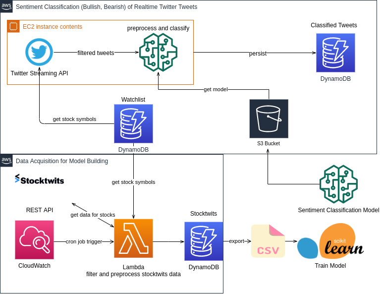

# StockSentimentAnalyser
Uses real-time Twitter tweets to determine the sentiment (bullish, bearish) of companies on a watchlist.

A machine learning model is used to classify the tweets accordingly. The training data was collected from Stocktwits.com over a time horizon of several months.

## Architecture

